# Домашнее задание к занятию «Helm» Барсуков А.А

### Цель задания

В тестовой среде Kubernetes необходимо установить и обновить приложения с помощью Helm.

------

### Чеклист готовности к домашнему заданию

1. Установленное k8s-решение, например, MicroK8S.
2. Установленный локальный kubectl.
3. Установленный локальный Helm.
4. Редактор YAML-файлов с подключенным репозиторием GitHub.

------

### Инструменты и дополнительные материалы, которые пригодятся для выполнения задания

1. [Инструкция](https://helm.sh/docs/intro/install/) по установке Helm. [Helm completion](https://helm.sh/docs/helm/helm_completion/).

------

### Задание 1. Подготовить Helm-чарт для приложения

1. Необходимо упаковать приложение в чарт для деплоя в разные окружения. 
2. Каждый компонент приложения деплоится отдельным deployment’ом или statefulset’ом.
3. В переменных чарта измените образ приложения для изменения версии.

### Ответ

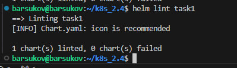

```
barsukov@barsukov:~/k8s_2.4$ helm template test task1 --debug
level=DEBUG msg="Original chart version" version=""
level=DEBUG msg="Chart path" path=/home/barsukov/k8s_2.4/task1
level=DEBUG msg="number of dependencies in the chart" dependencies=0
---
# Source: myapp/templates/api/service.yaml
apiVersion: v1
kind: Service
metadata:
  name: api-app-service
  namespace: default
  labels:
    app: api-app
    chart: "myapp-0.1.0"
    release: test
    heritage: Helm
spec:
  type: ClusterIP
  ports:
    - port: 80
      targetPort: 80
      protocol: TCP
      name: http
  selector:
    app: api-app
---
# Source: myapp/templates/web/service.yaml
apiVersion: v1
kind: Service
metadata:
  name: web-app-service
  namespace: default
  labels:
    app: web-app
    chart: "myapp-0.1.0"
    release: test
    heritage: Helm
spec:
  type: ClusterIP
  ports:
    - port: 80
      targetPort: 80
      protocol: TCP
      name: http
  selector:
    app: web-app
---
# Source: myapp/templates/api/deployment.yaml
apiVersion: apps/v1
kind: Deployment
metadata:
  name: api-app
  namespace: default
  labels:
    app: api-app
    chart: "myapp-0.1.0"
    release: test
    heritage: Helm
spec:
  replicas: 1
  selector:
    matchLabels:
      app: api-app
  template:
    metadata:
      labels:
        app: api-app
        version: "1.25"
    spec:
      containers:
        - name: api
          image: "nginx:1.25"
          imagePullPolicy: IfNotPresent
          ports:
            - name: http
              containerPort: 80
              protocol: TCP
          env:
            - name: APP_VERSION
              value: "1.0"
            - name: API_ENV
              value: "production"
            - name: NAMESPACE
              value: "default"
            - name: ENVIRONMENT
              value: "production"
          livenessProbe:
            httpGet:
              path: /
              port: 80
            initialDelaySeconds: 30
            periodSeconds: 10
          readinessProbe:
            httpGet:
              path: /
              port: 80
            initialDelaySeconds: 5
            periodSeconds: 5
---
# Source: myapp/templates/web/deployment.yaml
apiVersion: apps/v1
kind: Deployment
metadata:
  name: web-app
  namespace: default
  labels:
    app: web-app
    chart: "myapp-0.1.0"
    release: test
    heritage: Helm
spec:
  replicas: 2
  selector:
    matchLabels:
      app: web-app
  template:
    metadata:
      labels:
        app: web-app
        version: "1.25"
    spec:
      containers:
        - name: web
          image: "nginx:1.25"
          imagePullPolicy: IfNotPresent
          ports:
            - name: http
              containerPort: 80
              protocol: TCP
          env:
            - name: APP_VERSION
              value: "1.0"
            - name: NAMESPACE
              value: "default"
            - name: ENVIRONMENT
              value: "production"
          livenessProbe:
            httpGet:
              path: /
              port: 80
            initialDelaySeconds: 30
            periodSeconds: 10
          readinessProbe:
            httpGet:
              path: /
              port: 80
            initialDelaySeconds: 5
            periodSeconds: 5
barsukov@barsukov:~/k8s_2.4$ 
```

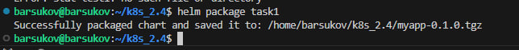

------
### Задание 2. Запустить две версии в разных неймспейсах

1. Подготовив чарт, необходимо его проверить. Запуститe несколько копий приложения.
2. Одну версию в namespace=app1, вторую версию в том же неймспейсе, третью версию в namespace=app2.
3. Продемонстрируйте результат.

#### Ответ

Создаем неймспейсы

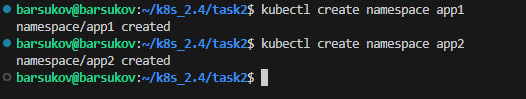


## УСТАНОВКА ПЕРВОЙ ВЕРСИИ (app1-v1)

Устанавливаем первую версию

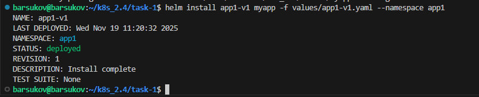
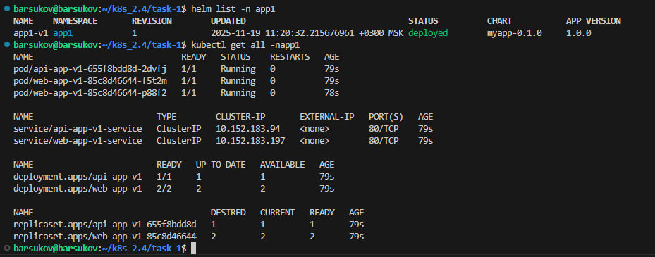

## УСТАНОВКА ВТОРОЙ ВЕРСИИ (app1-v2)
Устанавливаем вторую версию в том же неймспейсе
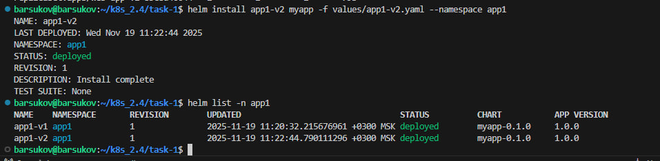

## УСТАНОВКА ТРЕТЬЕЙ ВЕРСИИ (app2)
Устанавливаем третью версию в другом неймспейсе
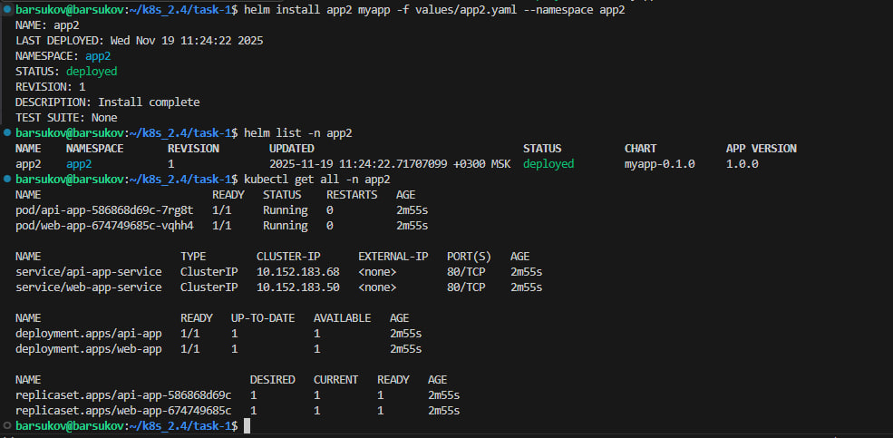

## РЕЗУЛЬТАТ
Все релизы во всех неймспейсах
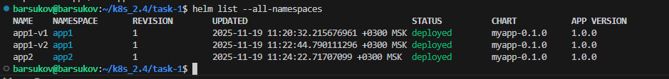

## Все поды с версиями образов

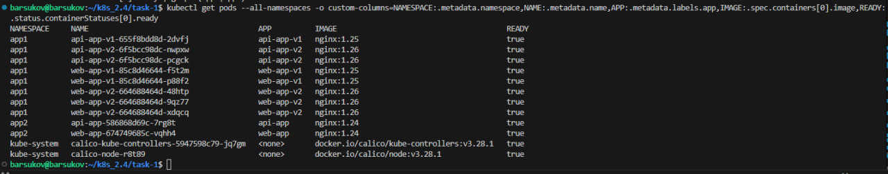

Информация по app1

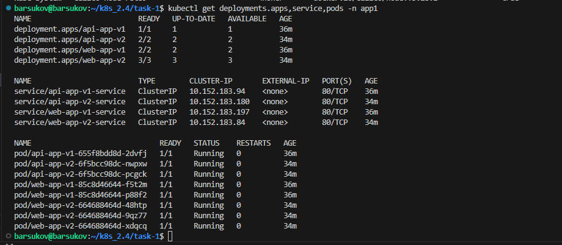

Информация по app2

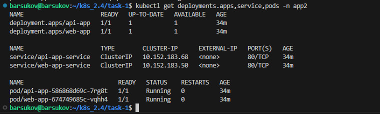


### Правила приёма работы

1. Домашняя работа оформляется в своём Git репозитории в файле README.md. Выполненное домашнее задание пришлите ссылкой на .md-файл в вашем репозитории.
2. Файл README.md должен содержать скриншоты вывода необходимых команд `kubectl`, `helm`, а также скриншоты результатов.
3. Репозиторий должен содержать тексты манифестов или ссылки на них в файле README.md.


